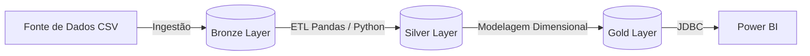
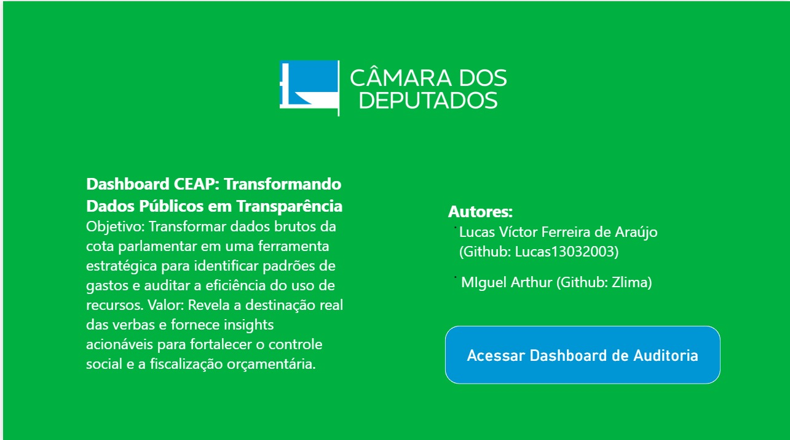
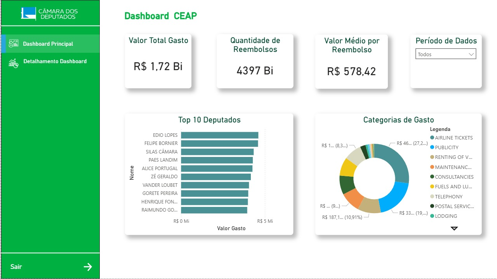
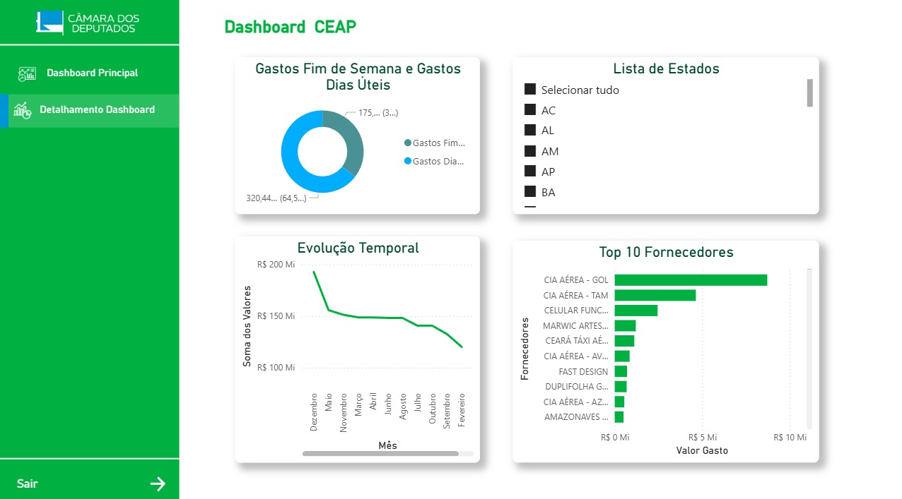

# 🏛️ Data Warehouse CEAP - Auditoria de Cotas Parlamentares

<p align="center">
  
  
  
  
  
</p>

##  Sobre o Projeto

Este projeto consiste na construção de um pipeline de **Engenharia de Dados End-to-End** focado em transparência e auditoria de gastos públicos. O objetivo central é extrair, processar, limpar, modelar e analisar os dados brutos de reembolsos referentes à **Cota para o Exercício da Atividade Parlamentar (CEAP)** da Câmara dos Deputados, facilitando auditorias investigativas e análises de Business Intelligence (BI).

O pipeline foi estruturado seguindo fortes práticas de Engenharia de Dados, com ênfase na **Arquitetura Medalhão**, garantindo dados confiáveis, organizados em modelagem dimensional (*Star Schema*) e visualizações dinâmicas e de alto impacto que evidenciam o domínio sobre o ciclo de vida completo dos dados.

---

##  Arquitetura da Solução

O fluxo de dados segue a clássica **Arquitetura Medalhão** (Bronze, Silver e Gold), visando governança, qualidade e rastreabilidade:



- ** Camada Bronze (Raw):** Armazenamento de dados em seu formato bruto (CSV), provindos da *Operação Serenata de Amor* (via Kaggle).
- ** Camada Silver (Trusted):** Refino, padronização, tratamento de dados nulos/ausentes e adequação de tipos utilizando Python e Pandas. Nesta etapa os dados foram persistidos em uma *One Big Table* limpa e confiável dentro do **PostgreSQL**.
- ** Camada Gold (Data Warehouse):** Modelagem multidimensional construída sob o padrão *Star Schema* (Tabela Fato de Recibos/Despesas rodeada pelas Dimensões: Partido, Político, e Tempo/Data). Estrutura altamente otimizada para queries analíticas e consumo pela ferramenta de BI.

---

##  Tecnologias e Ferramentas

O ecossistema do projeto foi selecionado para refletir o cenário de mercado em times de dados:

- **Linguagem & Processamento de Dados:** Python, Pandas, Jupyter Notebooks
- **Banco de Dados & DW:** PostgreSQL
- **Orquestração de Ambiente:** Docker e Docker Compose
- **Visualização & BI:** Power BI
- **Modelagem de Dados:** BRModelo (DLD, MER, DER)

---

##  Regras de Negócio e Auditoria: "O Pentágono da Fiscalização"

O grande diferencial analítico deste Data Warehouse é a implementação de um motor lógico de auditoria de dados, concebido para identificar possíveis anomalias, abusos ou fraudes em verbas indenizatórias. Estas regras refletem a capacidade de traduzir requisitos de negócios e leis em métricas técnicas. Nós as denominamos **Pentágono da Fiscalização**:

1. ** Estouro do Teto Estadual:** Monitoramento do volume de gastos mensais frente ao limite (teto) estabelecido para a Unidade Federativa (UF) específica de cada parlamentar.
2. ** Limites "Hard Cap" por Categoria:** Auditoria cruzada entre a despesa declarada e o teto inacumulável permitido por lei para subcategorias (Ex: Táxi restrito a R$ 2.700,00; Combustíveis a R$ 9.392,00).
3. ** A "Farra do Fim de Semana" (Comportamento):** Flagging de despesas relacionadas à alimentação ou hospedagem faturadas exclusivamente durante sábados, domingos e feriados.
4. ** O Viajante Misterioso (Geografia):** Identificação de gastos territoriais atípicos — despesas efetuadas em estados diferentes da base eleitoral do parlamentar que também não ocorreram no Distrito Federal.
5. ** O "Dedo Nervoso" (Repetição):** Mapeamento de transações repetidas em um mesmo dia, pelo mesmo deputado, no mesmo fornecedor, com valores idênticos. Indicativo analítico para investigar possível fracionamento de notas fiscais.

---

##  Dashboards e Visualizações Analíticas

Esta seção concentra os resultados entregues ao usuário final (Business). Os painéis no Power BI demonstram não apenas o agregado financeiro da cota parlamentar, mas destacam os relatórios de exceção baseados nas regras do Pentágono da Fiscalização.

<div align="center">
  
  <p><i>Figura 1: Dashboard Analítico - Visão Geral.</i></p>
  
  <br>

  
  <p><i>Figura 2: Análise de Métricas e KPIs.</i></p>
  
  <br>

  
  <p><i>Figura 3: Auditoria e Regras de Negócio.</i></p>

  <br>

  
  <p><i>Figura 4: Detalhamento de Despesas.</i></p>

  <br>

  
  <p><i>Figura 5: Resultados da Fiscalização.</i></p>
</div>

---

##  Como Executar o Projeto Localmente

1. **Clone este repositório:**
   ```bash
   git clone https://github.com/seu-usuario/ceap-data-warehouse.git
   cd ceap-data-warehouse
   ```

2. **Inicialize a infraestrutura (PostgreSQL):**
   ```bash
   docker-compose up -d
   ```

3. **Instale as dependências de Engenharia de Dados:**
   ```bash
   pip install -r requirements.txt
   ```

4. **Execute o Pipeline ETL:**
   - Acesse os notebooks localizados na pasta correspondente, processe a camada Silver, e execute as queries DDL/DML para carga na camada Gold.
   - Conecte o Power BI usando as credenciais do Postgres declaradas no `docker-compose.yml`.

---

## Colaboradores
Projeto acadêmico desenvolvido na disciplina de *Sistemas de Banco de Dados 2* (Universidade de Brasília).
